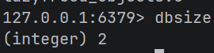
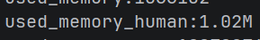
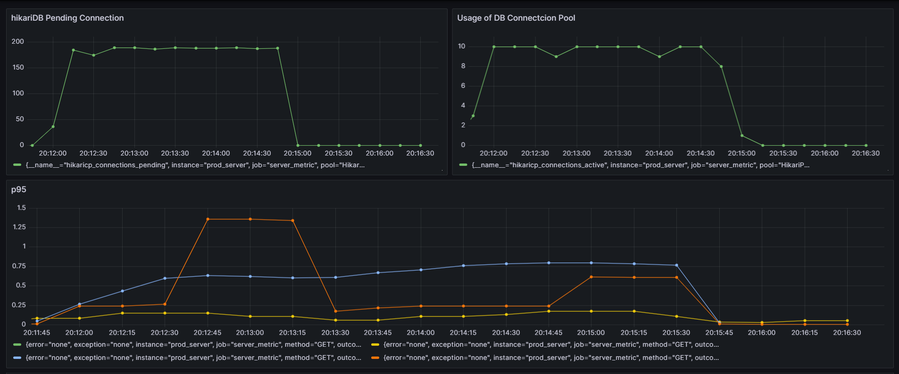
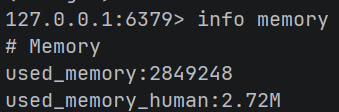
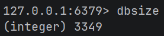

# 캐시 사용해보기
## 가설
캐싱을 사용할 때 모든 영화를 일괄적으로 가져오는 것보다 일정기간동안 일정횟수 이상 조회요청이 들어온 엔티티만 캐싱하면 어떨까?

## 캐시 미사용 시 부하테스트

```javascript
import http from 'k6/http';
import { check, sleep } from 'k6';

const BASE_URL = 'http://localhost:8080';

export const options = {
    stages: [
        { duration: '30s', target: 300 },
        { duration: '30s', target: 500 },
        { duration: '1m', target: 1000 },
        { duration: '1m', target: 3000 },
        { duration: '30s', target: 0 },
    ],

    thresholds: {
        http_req_duration: ['p(95)<500'],
        http_req_failed: ['rate<0.05'],
    },
};

export default function () {

    let movieId;

    // 80% 확률로 인기 영화 2개에 집중
    const random = Math.random();

    if (random < 0.4) {
        // 영화 1
        movieId = 1;

    } else if (random < 0.8) {
        // 영화 2
        movieId = 2;

    } else {
        // 나머지 98개 영화 랜덤
        movieId = Math.floor(Math.random() * 98) + 3;
    }

    const res = http.get(
        `${BASE_URL}/api/movie/${movieId}`
    );

    if (res.status !== 200) {
        console.log(res.status);
        console.log(res.body);
    }

    check(res, {
        'movie detail success': (r) => r.status === 200,
    });

    sleep(0.3);
}
```
특정 영화 두 편에 조회가 몰리는 상황을 구현했고, 단순 DB 조회이기 때문에 VU를 3000개를 사용하였다.


커넥션풀 대기 수(hikariDB Pending Connection)이 최대 180개로 늘어났고, 커넥션풀 대기 수가 늘어남에 따라 커넥션풀 대기 수도 10개로 최대로 사용 중이었다.


영화 조회에 대한 p95(파란색 줄)는 최대 0.5를 상회하고 있었다.


RPS는 1000 가량


## 일괄 캐시 적용

커넥션풀 대기 수 및 사용 수가 증가하지 않았다. DB에 요청이 전부 들어오지 않으므로 레디스 캐시에서 요청을 처리 중이다.


p95 (파란색) 역시 0.3초 정도로 줄어들었다.


RPS는 이전보다 크게 늘어난 1700 가량을 기록했다. 

### 영화의 수를 늘렸을 때

영화의 수를 1만 개로, TTL을 5초로 줄이자 다시 DB의 부하가 시작되었다.


p95는 0.5초 대로 큰 차이가 없었지만, 몇 번의 테스트를 진행한 결과 p95의 총합은 2.55초(캐시없음) → 1.8~9초(영화 1만 개, TTL 5초) → 1.5초(영화 1백 개, TTL 5초) → 1.4초(영화 1만 개, TTL 10분) → 1.36초(영화 1백 개, TTL 10분) 순이었다. (k6 기준)


데이터의 수가 늘어나자 RPS는 1400 가량으로 감소했다.


캐시 히트율은 약 89%를 보인다.


1만 개의 영화 중 9969개의 영화가 캐싱되었으며, 약 5Mb의 데이터가 캐싱되었다. 캐싱할 데이터가 단순한 json 데이터이기 때문에 캐싱된 데이터의 수에 비해 용량이 적은 것으로 보인다.

## 조건부 캐싱 적용
```java
@Transactional(readOnly = true)
public MovieSearchResponseDTO movieSearchById(Long id){
    String countKey = "movie:count:" + id;
    String cacheKey = "movies::" + id;

    Long count = redisTemplate.opsForValue().increment(countKey);
    if (count == 1) {
        redisTemplate.expire(countKey, Duration.ofSeconds(60));
    }

    if (count >= 3) {
        MovieSearchResponseDTO cached = (MovieSearchResponseDTO) redisTemplate.opsForValue().get(cacheKey);
        if (cached != null) return cached;

        Movie movie = movieRepository.findById(id).orElseThrow(
            () -> new CustomException(ErrorCode.NOT_FOUND_MOVIE)
        );
        MovieSearchResponseDTO result = MovieSearchResponseDTO.from(MovieWrapperDTO.create(movie));
        redisTemplate.opsForValue().set(cacheKey, result, Duration.ofMinutes(10));
        return result;
    }

    Movie movie = movieRepository.findById(id).orElseThrow(
            () -> new CustomException(ErrorCode.NOT_FOUND_MOVIE)
    );
    return MovieSearchResponseDTO.from(MovieWrapperDTO.create(movie));
}
```


30초 간 10회 이상 검색되는 영화만 캐싱하도록한 결과



캐싱되는 데이터의 수는 줄였으나 p95가 캐싱을 하지 않았을 때보다 늘어버린다는 단점이 있다.


30초 간 3회 이상 검색되는 영화만 캐싱하도록한 결과
오히려 캐시를 사용하지 않는 것보다 성능이 떨어졌다.



하지만 캐싱 메모리는 감소시켰다.

## 결과
무차별적 캐싱은 캐시 메모리를 많이 소모하기 때문에 조건부 캐싱이 더 성능이 좋을 것으로 예측했지만, 오히려 조건부 캐싱에서 조건탐색로직에 때문에 성능이 약 1.5배 정도 더 낮은 편이었다.

복잡한 로직에서는 다른 방안을 사용해야겠지만 이번 예시처럼 간단한 쿼리문 같은 경우에는 데이터의 수가 많더라도 조건 분기 로직을 사용하지 않는게 성능에 더 도움이 된다는 것을 알 수 있었다.