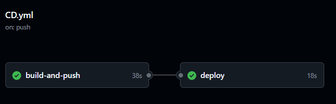
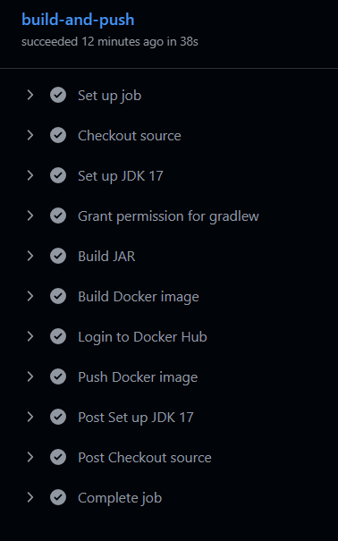
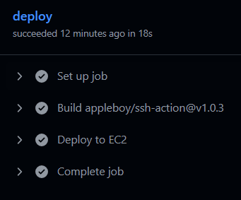

# 코드 리팩토링
테스트를 거치면서 괜찮은 코드 리팩토링을 진행했다.

음식을 주문할 때 기존에는 RDD 방식을 따라서
Service 계층 → Cart → CartItem → TheaterMenu 순으로 책임이 위임되어 TheaterMenu가 수량을 감소시키고, 비관적락이 TheaterMenu 테이블에 있었으나 동시성 테스트하면서 동시성 처리에 불리한 구조임을 파악하고 서비스 계층에서 직접 TheaterMenu 계층에 접근하도록했다. 완벽한 캡슐화에서는 다소 멀어졌으나 3개의 재고가 있는 상황에서 4명이 요청을 보냈을 때 기존에는 1명만 구매에 성공했다면, 적어도 2~3명 정도는 구매를 성공할 수 있게 효과적으로 비동기처리를 진행할 수 있었다.


# CI/CD
CI(Continuous Integration, 지속적 통합): main 브랜치에 자동병합 또는 자동PR
CD(Continuous Deployment/Delivery, 지속적 배포): 배포의 자동화로 수정된 코드가 즉시 운영환경까지 배포됨

## Gihub Action

Github Action을 사용하여 CI/CD 구조를 만들었다.

```yml
name: EC2 Docker CI/CD

on:
  push:
    branches: [ "kimdoes" ]

jobs:
  build-and-push:
    runs-on: ubuntu-latest

    steps:
      - name: Checkout source
        uses: actions/checkout@v4

      - name: Set up JDK 17
        uses: actions/setup-java@v4
        with:
          distribution: temurin
          java-version: '17'
          cache: gradle

      - name: Grant permission for gradlew
        run: chmod +x gradlew

      - name: Build JAR
        run: ./gradlew clean bootJar -x test

      - name: Build Docker image
        run: |
          docker build -t ${{ secrets.DOCKER_USERNAME }}/spring-cgv:latest .

      - name: Login to Docker Hub
        run: echo "${{ secrets.DOCKER_PASSWORD }}" | docker login -u ${{ secrets.DOCKER_USERNAME }} --password-stdin

      - name: Push Docker image
        run: docker push ${{ secrets.DOCKER_USERNAME }}/spring-cgv:latest


  deploy:
    needs: build-and-push
    runs-on: ubuntu-latest

    steps:
      - name: Deploy to EC2
        uses: appleboy/ssh-action@v1.0.3
        with:
          host: ${{ secrets.EC2_HOST }}
          username: ubuntu
          key: ${{ secrets.EC2_KEY }}
          script: |
            docker pull ${{ secrets.DOCKER_USERNAME }}/spring-cgv:latest

            docker stop spring-app || true
            docker rm spring-app || true

            docker run -d \
              --name spring-app \
              -p 8080:8080 \
              ${{ secrets.DOCKER_USERNAME }}/spring-cgv:latest
```
 
.yml 파일을 작성하면 이에 따라서 run 부분의 코드가 실행되고, 깃허브에서 name 값으로 어떤 작업을 수행했는지 표시되게 된다. 따라서 깃허브의 특정 동작 (특정 브랜치에 push 등...)을 트리거하여 특정한 동작을 수행하게끔한다.

- Checkout source | 깃허브 저장소 코드 다운로드
- set up JDK17 | github Actions 환경에 JDK17 설치
- Grant permission for gradlew | gradlew 설정
- Build JAR | Spring Boot JAR 설정
- Build Docker Image | 현재 프로젝트를 기반으로 도커 이미지 생성. Dockerfile이 이 때 활용됨
- Login to Docker Hub | 도커 로그인
- Push Docker image | 도커 허브에 이미지 업로드

- Deploy to EC2 | EC2 접속 및 도커 업로드, 이미 실행 중인 도커 컨테이너가 있다면 종료시키고 새 컨테이너를 실행시킨다.


# 느낀점
DevOps 엔지니어, 인프라 엔지니어 등에 대해서 들어만봤고, 또 어려울 것이라 생각했는데 실제로도 어려웠다. 아직은 AWS와 배포에 대해서 아리송한 부분이 많고, 어떤 과정을 통해 배포가 이루어지는지도 보다 심도있게 조사해보고 싶었다. 좋은 공부거리가 될 것 같았다.
또, AWS RDS를 사용하면서 DB 설정도 추가로 변경했어야했는데, 이 과정에서 DB URL을 기존 localhost 기반 DB 주소에서 RDS 주소로 변경, RDS 보안설정에서 EC2 IP의 요청허가 등 손봐야할 일이 많았다. .env 파일을 도커 컨테이너에 추가하지 않아서 또 에러가 발생하기도하였다. 팀 프로젝트에서는 보다 꼼꼼하게 AWS 세팅을 완료해야할 것 같다. 그래도 평소 배워보고 싶지만 어려워보여서 엄두가 나지 않았던 내용에 대해 배울 수 있었다.