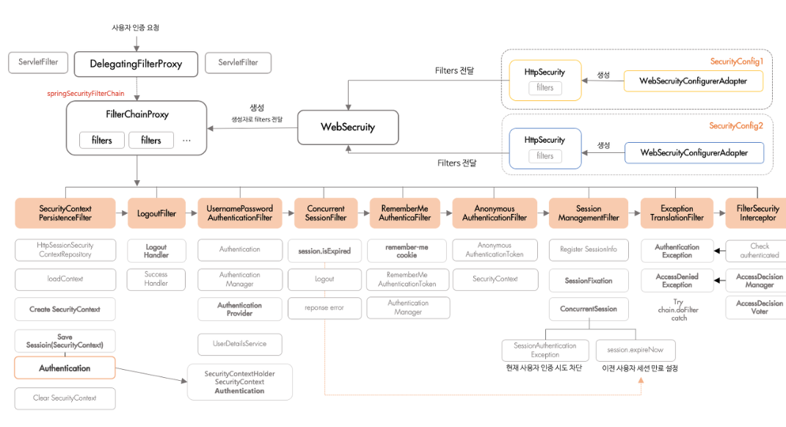
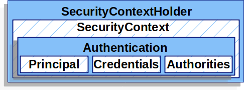
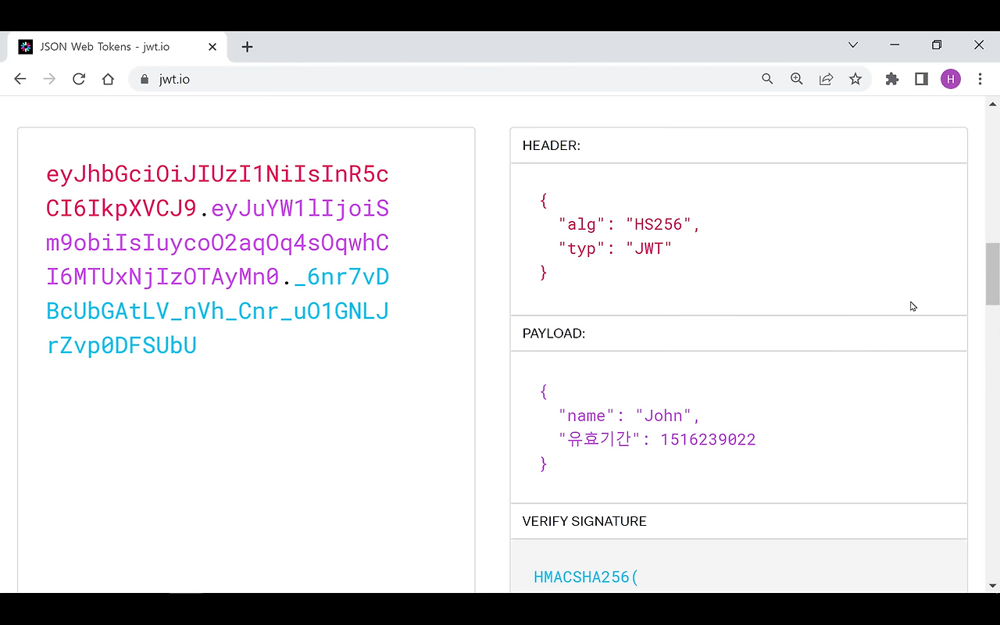
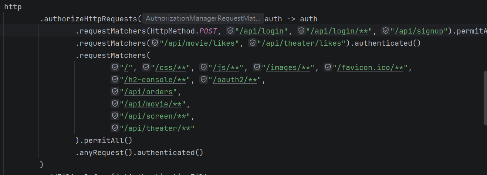
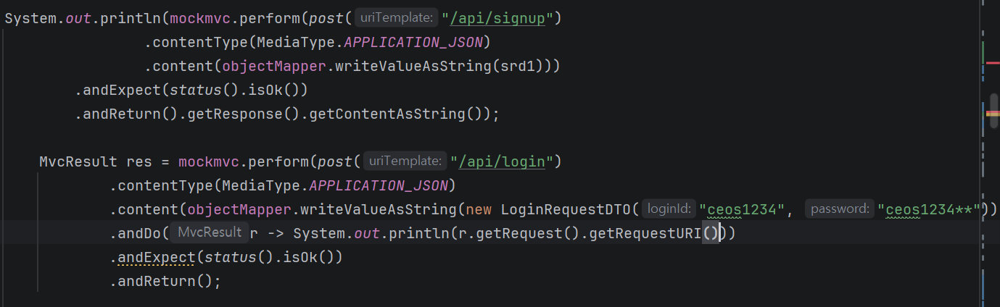
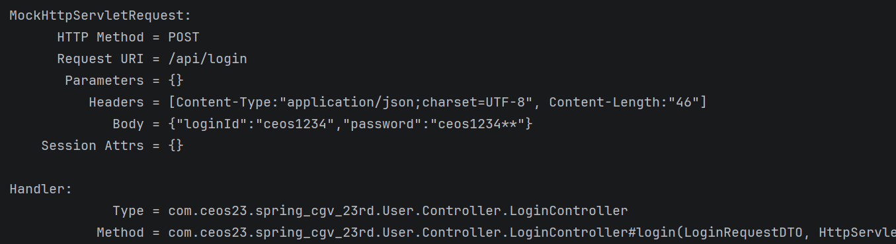
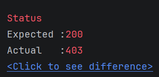

# SecurityContext

스프링 시큐리티의 필터는 위와 같이 이루어져있다.
여러 개의 필터들이 모여서 FilterChainProxy를 이루고, 톰캣의 필터에 FilterChainProxy를 DelegatingFilterProxy가 등록해 톰캣서버의 필터가 스프링에서 관리하는 필터로 요청을 전하는 과정으로 이루어진다.

필터의 최종 목적은 SecurityContextHolder에 Authentication 객체를 넣는 과정이다. Authentication 객체는 요청을 보낸 유저의 정보를 담는 역할을 한다.

이 SecurityContextHolder는 SecurityContextHolderFilter가 가져오는 것을 담당한다. 요청 가장 앞단에서 이 필터가 동작하여 Authentication 객체를 가져온다.

Authentication에는 Principal (식별자), Credentials(비밀번호), Authorities (권한)이 저장된다.

## 로그인 요청 시
AuthenticationFilter는 로그인 요청 시 동작한다. 이 필터는 로그인 요청에 대해서 유저가 실제로 존재하는지 여부 등을 조사하고, 최종적으로는 Authentication 객체를 만들고 SecurityContext에 등록한다.

SpringSecurityConfig에 로그인 URI를 지정할 수 있는데, 이걸 통해서 인증이 필요한 사용자를 로그인창으로 돌려보내거나, AuthenticationFilter가 동작하는 시점을 지정할 수 있다.

AuthenticationFilter가 동작하기 시작했다면 뒷단의 필터는 동작하지 않고 SuccessHandler가 몇가지 추가사항을 처리하고 로그인이 종료된다.

## 로그인 요청이 아닐 경우
이 경우에는
ConcurrentSessionFilter(세션 만료 여부를 확인, 세션이 없거나 만료되지 않은 경우 통과)
- RememberMeAuthenticationFilter(세션 이외의 쿠키를 통해서 유저정보가 저장되는 경우도 있는데, 이를 검사)
- AnonymousAuthenticationFilter(앞선 과정에서도 로그인되지 않은, 완전한 비로그인 사용자인 경우 비로그인 Authentication 객체를 형성. 매번 Authentication 객체에 대해 NPE를 조사하는 것보다 통일된 처리가 가능)
- SessionManagementFilter(세션 원칙 조사, 동시에 접속 가능한 세션보다 많이 접속 중일 경우 어떻게 처리할지 설정 가능)
- ExceptionTranslationFilter(AuthorizationFilter에서 발생한 에러처리)
- AuthorizationFilter(인증정보를 통해 인가과정 처리. SpringSecurityConfig를 확인하며 조사한다.) 순으로 동작한다.

## JWT 토큰
JWT토큰은 헤더.페이로드.시그니처로 이루어진 하나의 토큰이며, 세션과 달리 별도의 저장소가 필요없고 서버는 단순히 유저의 토큰만 확인하면 된다는 특징이 있다. (STATELESS)

### 헤더
해시 알고리즘의 종류를 저장한다.

### 페이로드
정보를 저장한다. JWT토큰 식별자, 생성시각, 만료시각, 유저의 정보 등이 여기에 저장된다.

### 시그니처
헤더와 페이로드를 헤더의 해시 알고리즘을 통해 해싱한 값이 저장된다. 서버는 유저의 JWT토큰을 다시 해싱하여 시그니처값과 비교, 토큰이 변경되었는지 여부를 조사한다.

현재 많이 쓰이는 시그니처 사용방식은 정확히 JWS (JSON Web Signiture), JSON 데이터를 암호화하면 JWE (JSON Web Encryption) 으로 칭한다. 순수 JWT는 시그니처를 사용하지 않는다고한다.

# 개발하기
이전에 작성한 코드를 수정하면서 새로이 로그인 기능도 개발했다.

## 기존 로직 리팩토링
최근 RDD에 관심있었는데 기존에 짠 코드를 보니 서비스계층에 과다한 책임이 부과되어 있는 것 같아서 도메인 계층에 책임을 조금 분배했다. 서비스계층을 오케스트라 클래스라고 생각하고 DB 접근기능과 도메인에 메시지를 보내는 과정을 서비스에서 처리하고, 되도록이면 도메인의 내부 상태를 변경시키는 로직은 도메인 내부에서 처리하려고 했다. 잘 되었는지는 모르겠지만 그래도 이전보다 확실히 간결하고 깔끔한 코드를 짠 것 같다.

### 기능 테스트

모든 기능이 로그인 기능개발 전까지 문제없이 기능이 동작했지만, SpringSecurityConfig를 작성하고 로그인 기능을 추가하니 permitAll()로 된 URI에 대해서도 403에러가 지속적으로 발생했다. 결국에는 이 문제를 해결하지 못해서 로그인 기능을 추가한 테스트 코드를 제대로 실행시켜보지 못했다. SpringSecurity도 수정해보고 JWTAuthenticationFilter도 수정해봤는데 여전히 에러가 발생하고, JWTAuthenticationFilter는 문제없이 동작하는데 컨트롤러에 요청이 가지 않고 403 에러가 발생해서 도저히 원인을 모르겠다. 원인을 분석해보는데 시간이 오래 걸릴 것 같다.

### 아쉬운 것
위의 403 에러가 해결되지 않아서 결국 OAuth2 처리와 RTR에 대해서 처리를 못했지만, 이전에 OAuth2와 JWTAuthenticationFilter 처리를 해본적이 있어서 그 경험을 토대로 새로 코드를 만들어보면 되지 않을까 생각한다. RTR까지 기회가 될 때 다시 도전해보려고 한다.