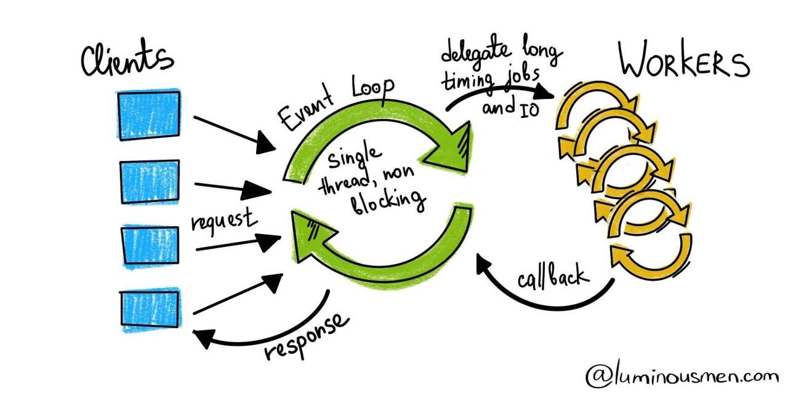
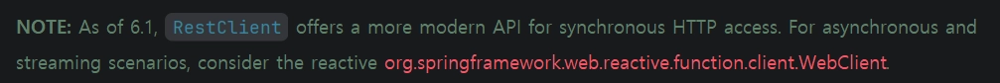
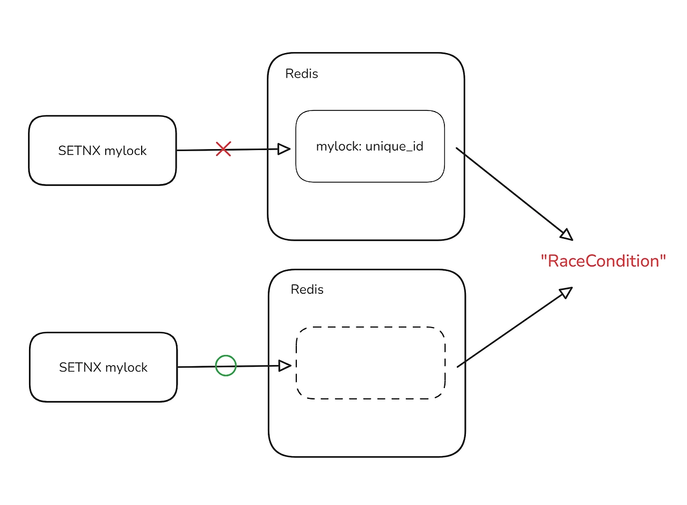
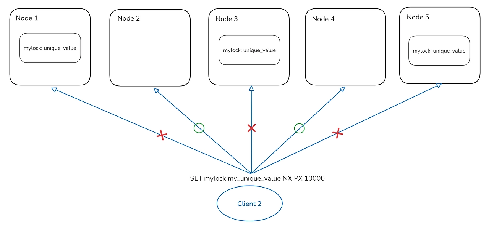
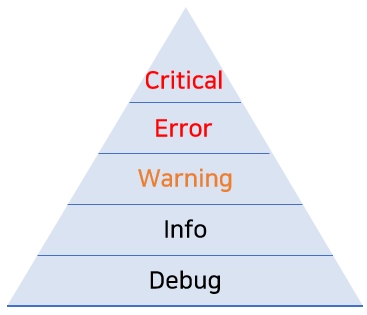
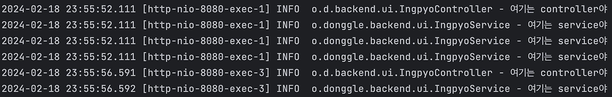
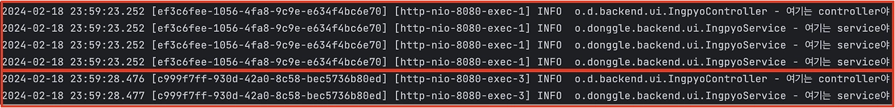
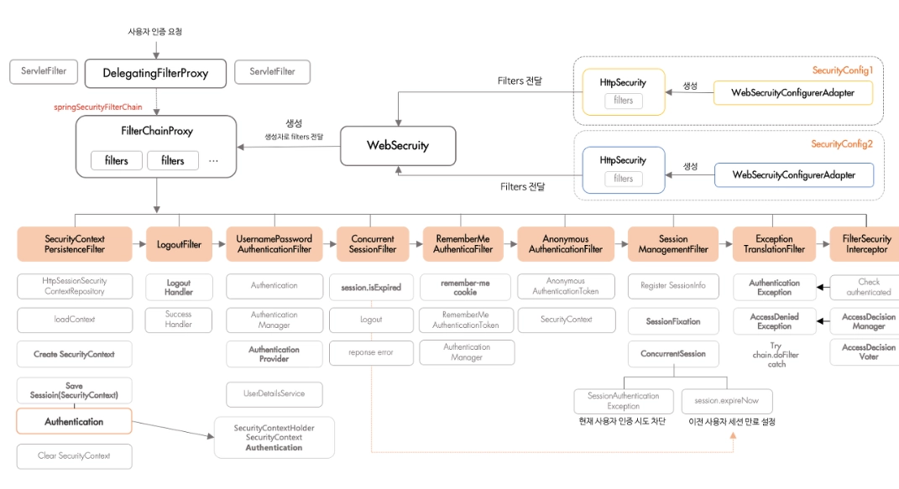

# 1. 코드 리팩토링

## 도메인과 책임 우선시하기

얼마전 <오브젝트>라는 책을 읽고 코드를 짜면서 **RDD**(책임주도개발, Responsibility Driven Design)를 따르며 개발해야겠다고 생각했다. 하나의 책임을 더 작은 책임으로 쪼갤 수 있는가? 그럴 수 없다면 어느 객체에게 이 책임을 할당해야하는가?라는 생각을 가지고 설계 및 개발에 임했다.

## 정보전문가 패턴

기존의 영화 예매 서비스에서는 “/reserve” API 주소로 요청을 받으면 Controller - Service 순서대로 요청이 전해지고, ReservationService가 Reservation 객체를 만들었다. 이렇게되면 “예약”이라는 책임을 ReservationService 객체가 담당하게된다.

GRASP 디자인 패턴 중 **책임을 객체에게 할당할 때, 그 책임에 대해 가장 많은 정보를 갖고 있는 객체에게 할당하라**는 원칙(**정보전문가 패턴**(Information Expert Pattern))이 있다.

```java
public class ReservationService {
    private final UserRepository userRepository;
    private final ScreeningRepository screeningRepository;
    private final DiscountPolicyFactory discountPolicyFactory;

    ReservationService(UserRepository userRepository,
                       ScreeningRepository screeningRepository,
                       DiscountPolicyFactory discountPolicyFactory){
        this.userRepository = userRepository;
        this.screeningRepository = screeningRepository;
        this.discountPolicyFactory = discountPolicyFactory
    }

    public ReservationResponseDTO reserve(String loginId, ReservationRequestDTO req){
        User user = userRepository.findByLoginId(loginId).orElseThrow(() -> new EntityNotFoundException("유저 정보가 없습니다."));
        Screening screening = screeningRepository.findById(req.screeningId()).orElseThrow(() -> new EntityNotFoundException("상영 정보가 없습니다."));

        seatValidator.checkValidity(screening, req.seatInfos());

        Reservation reservation = Reservation.create(
                user,
                screening,
                req.toReservingSeats(),
                discountPolicyFactory.create(screening, req.toSeatInfos())
        );

        reservationRepository.save(reservation);
        return ReservationResponseDTO.createForReserve(user, reservation);
    }
}
```

기존에는 ReservationService가 Reservation 객체를 직접 생성하는, “예매하기”에 대한 책임을 수행하고 있다. 하지만 ReservationService는 영화예매라는 책임에 대한 정보전문가가 아니다. 영화예매에 대한 정보전문가는 Screening 객체다. 따라서 정보전문가인 Screening 객체에게 영화예매에 대한 책임을 할당해야한다.

## Creator 패턴

- B가 A 객체를 포함하거나 참조한다.
- B가 A 객체를 기록한다.
- B가  A 객체를 긴밀하게 사용한다.
- B가 A 객체를 초기화하는 데 필요한 데이터를 가지고 있다. (B가 A에 대해 정보 전문가다)

객체가 생성되어야할 때 생성되는 객체와 연결되거나 그럴 필요가 있는 객체에게 생성에 대한 책임을 맡기는 GRASP 디자인 패턴을 CREATOR 패턴이라고 칭한다.

따라서 영화예매 책임에 대한 정보전문가인 Screening 객체가 책임을 수행하고, 이에따라 Reserve 객체도 생성하도록해 정보전문가패턴과 Creator 패턴을 사용한다.

```java
@Service
public class ReservationService {
    private final UserRepository userRepository;
    private final ScreeningRepository screeningRepository;
    private final SeatValidator seatValidator;
    private final DiscountPolicyFactory discountPolicyFactory;

    ReservationService(UserRepository userRepository,
                       ScreeningRepository screeningRepository,
                       SeatValidator seatValidator,
                       DiscountPolicyFactory discountPolicyFactory){
        this.userRepository = userRepository;
        this.screeningRepository = screeningRepository;
        this.seatValidator = seatValidator;
        this.discountPolicyFactory = discountPolicyFactory;
    }

    ...

    public ReservationResponseDTO reserve(String loginId, ReservationRequestDTO req){
        User user = userRepository.findByLoginId(loginId).orElseThrow(() -> new EntityNotFoundException("유저 정보가 없습니다."));
        Screening screening = screeningRepository.findById(req.screeningId()).orElseThrow(() -> new EntityNotFoundException("상영 정보가 없습니다."));

        seatValidator.checkValidity(screening, req.seatInfos());

        Reservation reservation = Reservation.create(
                user,
                screening,
                req.toReservingSeats(),
                discountPolicyFactory.create(screening, req.toSeatInfos())
        );

        reservationRepository.save(reservation);
        return ReservationResponseDTO.createForReserve(user, reservation);
    }

    ...
}

```

기존코드

```java
public ReservationResponseDTO reserve(String loginId, ReservationRequestDTO req){\
    User user = userRepository.findByLoginId(loginId).orElseThrow(() -> new EntityNotFoundException("유저 정보가 없습니다."));
    Screening screening = screeningRepository.findById(req.screeningId()).orElseThrow(() -> new EntityNotFoundException("상영 정보가 없습니다."));

    Reservation reservation = screening.reserve(
        user, req, seatValidator, discountPolicyFactory
    );

    reservationRepository.save(reservation);
    return ReservationResponseDTO.createForReserve(user, reservation);
}
```

수정된 ReservationService.reserve() 메서드

```java
public Reservation reserve(User user, ReservationRequestDTO req,
                                      SeatValidator seatValidator,
                                      DiscountPolicyFactory factory){
    seatValidator.checkValidity(this, req.seatInfos());

    return Reservation.create(
        user,
        this,
        req.toReservingSeats(),
        factory.create(this, req.toSeatInfos())
    );
}
```

Screening 객체에 추가된 reserve 코드

좌석의 유효성을 검증하고, 예약정보를 담은 Reserve 객체를 생성해 최종적으로 예매기능에 대한 책임을 담당하게되어 정보전문가패턴과 CREATOR 패턴을 준수하게되었고, SeatValidator와 DiscountPolicyFactory 등의 의존성에 대해서는 스프링 DI를 사용하지않고 생성자 주입방식을 사용하였다.

# 결제 및 동시성

## HTTPClient

```java
import java.net.URI;
import java.net.http.HttpClient;
import java.net.http.HttpRequest;
import java.net.http.HttpResponse;

public class HttpClientExample {
    public static void main(String[] args) throws Exception {
        HttpClient client = HttpClient.newHttpClient();

        HttpRequest request = HttpRequest.newBuilder()
            .uri(URI.create("https://api.example.com/data"))
            .GET()
            .build();

        HttpResponse response = client.send(request, HttpResponse.BodyHandlers.ofString());

        System.out.println(response.statusCode());
        System.out.println(response.body());
    }
}

```

JDK11부터 제공되는 HTTP 통신용 라이브러리. 같은이름으로 아파치에서 제공하는 라이브러리도 존재한다. 다른 API에 HTTP 요청을 전송하고, 응답을 받아오는 등의 HTTP 요청을 수행한다.

## RestTemplate

```java
@RestController
public class ApiController {

    private final RestTemplate restTemplate = new RestTemplate();

    @GetMapping("/call-api")
    public String callApi() {
        String url = "https://api.example.com/data";
        ResponseEntity response = restTemplate.getForEntity(url, String.class);
        return response.getBody();
    }
}
```

스프링3부터 사용되는 HTTP 요청용 객체. 기존에는 응답을 받아온 후 직접 파싱해야했지만 RestTemplate를 사용하여 자동으로 객체 또는 DTO로 매핑이 가능하다.

## WebClient

```java
WebClient client = WebClient.builder()
  .baseUrl("http://localhost:8080")
  .defaultCookie("cookieKey", "cookieValue")
  .defaultHeader(HttpHeaders.CONTENT_TYPE, MediaType.APPLICATION_JSON_VALUE) 
  .defaultUriVariables(Collections.singletonMap("url", "http://localhost:8080"))
  .build();
```

스프링5에서 등장한 HTTP 요청용 객체.

기존의 RestTemplate은 자바의 Servlet API를 사용하기 때문에 요청 하나당 스레드 한 개를 사용해 처리하기 때문에, 요청을 보낸 후 응답을 받기까지 사용 중인 스레드를 활용할 수 없다는 단점이 있었다. 트래픽이 몰리는 경우에는 스레드의 수가 늘어나 성능 저하가 발생할 수 있었다.


WebClient는 Event-Driven 구조를 사용한다. 따라서 요청을 보낸 후, 요청이 완료된 다음 콜백이 오기 전까지 스레드를 재사용하거나 다른 일을 수행할 수 있다. 따라서 RestTemplate보다 더 유연한 처리가 가능하다.


따라서 스프링에서는 WebClient의 등장 이후로 WebClient 사용을 권장하고 있다.

## FeignClient

```java
@FeignClient(name = "githubClient", url = "https://api.github.com")
public interface GitHubClient {

    @GetMapping("/users/{username}")
    GitHubUser getUser(@PathVariable("username") String username);
}
```

FeignClient는 기존 스프링 어노테이션을 활용하여 HTTP 요청을 더 간편하게 보내기 위해 등장하였다. 위에서 getUser() 메서드를 사용하면 자동으로 https://api.github.com/users/{username}으로 GET 요청이 보내진다.

MSA 환경에서는 다른 프로세스 또는 서버로 요청을 보내야할 때가 있는데, 이 때 HTTP 요청을 FeignClient로 처리하면 유용하게 처리할 수 있다. 이처럼 간단한 요청, 또는 동기요청의 경우에는 FeignClient를 사용하면 기존보다 훨씬 간단하게 요청을 보내고, 응답을 받아올 수 있다.

단점으로는 RestTemplate와 같은 방식으로 동작하므로 RestTemplate의 단점인 트래픽이 몰릴 경우 시스템에 부하가 생기고, 스레드 재사용이 불가하다는 등의 단점이 있다. 따라서 동기로 처리해야할 경우, 처리속도가 중요한 경우는 WebClient로, 이외에는 편리한 FeignClient를 사용하는 것이 좋다. 또는 @FeignClient 어노테이션이 아니라 @ReactiveFeignClient 어노테이션을 사용해 WebClient의 장점을 가져올 수 있다.

# 결제 및 동시성

## 어플리케이션에서 해결하기 - 모니터락

자바에서 모든 객체들은 내부에 락을 하나씩 가지고 있는데, 이 락을 모니터락라고 칭한다. 자바에서 synchronized 키워드를 사용한 부분(메서드 또는 블럭)에 도달하면 모니터락을 획득해야 임계영역에 들어갈 수 있다. syncronized 키워드에 들어갈 때 락을 획득하고, 임계영역의 작업을 수행한 뒤, 다시 나오는 방식.

자바에서 가장 기본적으로 제공하는 락 방식이며, 한 번에 한 개의 스레드만 사용할 수 있다

## synchronized는 만능이 아니다

우선은 분산시스템에서는 사용하지 못한다. 또한 synchronized을 사용하면 @Transactional 어노테이션을 사용할 수 없다는 단점이 있다.

이는 Spring AOP에 기인한 것으로, 스프링 AOP는 프록시 객체를 만들어 원래 객체의 메서드가 끝나고 트랜잭션을 커밋시키는데, 이 때 프록시 객체는 synchronized 처리가 되어있지 않으므로 (메서드 시그니처에 synchronized는 포함되지 않는다) 따라서 락을 새로 취득하고 들어온 객체는 커밋 이전의 데이터를 보게된다. 이를 **갱신손실**이라고 칭하며, synchronized만 사용해 DB에 접근하면 이를 막을 수 없다.

이처럼 synchronized는 분산환경에서는 사용할 수 없고, 트랜잭션도 사용할 수 없고, 한 번에 한 스레드만 락을 획득할 수 있어 성능저하도 있기 때문에 잘 안쓰인다고한다. 이를 위해서 DB 계층에서 락을 걸어주는 DB락이 있다.

```java
@Entity
public class Board {

  @Id
  private String id;
  
  private String name;

  @Version
  private Integer version;
}
```

```java
public interface BoardRepository extends JpaRepository<Board, String> {

    @Lock(LockModeType.OPTIMISTIC)
    @Query("select b from Board b where b.id = :id")
    Optional<Board> findByIdForUpdate(@Param("id") String id);
}
```

**낙관적**(Optimistic) 락은 트랜잭션 충돌이 일어나지 않을 것으로 “낙관적”으로 가정하는 방법. 엔티티 수준에서 동시성을 제어하는 방법으로, 모든 엔티티들은 필드에 Version 값을 가지고, DB에 커밋을 날릴 때마다 엔티티의 Version 값이 변한다. 커밋 시 엔티티의 버전과 DB의 버전을 비교해 동시성 충돌여부를 조사한다.

```java
public void does(){
    for (;;) {
        try {
            reservationService.reserve();
            break;
        } catch (Exception e) {
            sleep(1000);
        }
    }
}

public void sleep(int time){
    try {
        Thread.sleep(time);
    } catch (Exception e) {
        throw new RuntimeException(e);
    }
}
```

JPA에서는 @Version 어노테이션만 있으면 사용가능하며, 동시성 충돌 시 추가로 로직을 개발해야한다. 낙관적 락이 적용된 DB테이블에 접근하는 객체를 try-catch 문을 통해 호출시키고, 예외처리도 추가로 진행해야한다.

버전값에 차이가 생기면 오류가 발생한다.

```java
public interface BoardRepository extends JpaRepository<Board, String> {

    @Lock(LockModeType.PESSIMISTIC_WRITE)
    @Query("select b from Board b where b.id = :id")
    Optional<Board> findByIdForUpdate(@Param("id") String id);
}
```

**비관적**(Pessimistic) 락은 트랜잭션 충돌이 반드시 일어날 것으로 “비관적”으로 가정하는 방법. DB 수준에서 동시성을 제어하는 방법이다

- PASSIMISTIC_READ(읽기 잠금) - 쓰기는 락 필요, 읽기는 자유
- PASSIMISTIC_WRITE(쓰기 잠금) - 쓰기, 읽기 모두 락 필요

락을 획득하지 못하거나, 너무 오래 대기하면 에러가 발생한다.

“동시에 수정이 빈번하게 일어나는가?”라는 질문에 동시수정이 적다면 낙관적 락을, 많다면 비관적락을 사용하는 것이 더 좋다. 비관적락은 성능부하가 낙관적락에 비해 다소 심하고, 낙관적락은 동시성 오류가 발생하지 않을 때까지 계속해서 작업을 재시도하기 때문에 이를 고려하는 것이 좋다.

현재 CGV 클론코딩에서는, 실제로 CGV 애플리케이션을 개발한다고하는 경우 많은 이용자와 많은 예약자, 그리고 사람들이 많이 몰릴 수 있는 특정 영화(무대인사, 사인회 등…) 때문에 비관적락을 사용하는 것이 좋아보인다.

## DB락은 만능이 아니다

비관적락을 사용하고, DB까지 분산시스템을 적용하는 경우, 락이 다른 노드까지 전달되지 않아서 다시 데이터 정합성 문제가 발생할 수 있다. 따라서 사용자와 DB서버 사이에 락을 총괄하는 시스템이 하나 있어야하며, 이를 **분산락**이라고 칭한다. 주로 레디스를 사용한다.

낙관적락을 사용할 경우에는 분산락을 사용하지 않아도 무방하다.


레디스를 사용하면 락을 레디스가 갖고 있으며, 레디스를 통해 DB에 접근해야할 경우 레디스가 락을 획득해야한다. 리소스마다 특정한 키를 갖고 있으며, 리소스에 접근할 때 레디스에 키를 등록한다. 만약 DB에 접근하고자 키를 등록하려했는데 레디스에 이미 키가 등록되어있다면 대기하는 방식. + 키에 서명을 통해 키를 등록한 서버만이 등록을 해제할 수 있도록 설정할 수 있다.

## 1개의 레디스는 만능이 아니다

한 개의 레디스 서버는 레디스 서버에 장애가 발생한 경우 모든 서비스가 멈춰버리는 **단일 장애 지점**(SPOF, Single Point Of Failure)이 될 수 있다. 따라서 여러 대의 레디스 서버를 사용해야한다.

다만 Lock을 다루고 있기 때문에 master 서버의 락을 획득한 후 레플리카 DB에 전해주기 전에 master 서버에 장애가 발생한 경우 Lock 취득에 대해서 문제가 생길 수 있기 때문에 일반적인 여러 대의 DB 서버와 같이 master-slave 구조를 사용할 수 없다. 따라서 레디스에서는 RedLock 알고리즘을 사용한다.



**RedLock 알고리즘**

1. 클라이언트는 N대의 레디스 서버에 순차적으로 락을 요청한다. 이때 유효시간은 아주 짧게 설정한다.
2. 레디스 서버로부터 응답을 받은 후, 유효시간 내 락을 성공적으로 획득한 레디스 서버의 수를 측정한다. 이 중 과반수 이상의 레디스 서버로부터 락을 획득했다면, 락 획득에 성공한 것으로 본다.
    1. 최종적으로 락 획득에 실패한 경우, 클라이언트는 락 획득에 성공한 서버들에게 락 해제 요청을 보낸다.
    2. 최종적으로 락 획득에 성공했으나, 락 획득에 실패한 과반수 이외의 레디스 서버들은 아무 동작도 실행하지 않는다. 이미 과반수의 레디스 서버에서 락을 획득하였으므로 다른 클라이언트가 락을 획득할 염려가 없다.

## RedLock도 만능은 아니다

### **Clock Drift**

단일 서버에서 synchronized를 사용하면 전 애플리케이션에 일괄적으로 적용되는 클럭이 있으므로 문제없지만, 분산시스템에서는 그렇지 않다. 그리고 만약 레디스 서버 간 클럭에 오차가 생기면 다른 노드들의 락이 해제되기 전에 락이 해제되는 노드가 발생할 수 있다.

1. 5개의 노드들 중에서 RedLock 알고르즘을 통해 3대의 노드에게서 락을 획득한다.
    1. 락을 획득하지 못한 2대의 노드들은 아무런 일도 수행하지 않는다. 다른 클라이언트에게서 락 요청이 들어와도 과반수를 넘지 못하므로 아무런 일도 일어나지 않는다.
2. 3대의 노드 중 한 대의 노드에서 클럭 드리프트가 발생해 락이 해제되었다.
3. 다른 클라이언트가 락 요청을 보냈고, 현재 락을 획득 중인 2대의 노드 이외의 3대의 노드에게서 락을 획득한다. 즉, 락을 획득한 클라이언트가 2대가 된다.

### **애플리케이션 중단**

클럭 드리프트는 낮은 확률로 발생하지만, 애플리케이션 중단의 경우에는 자주 일어나면서 클럭 드리프트와 비슷한 결과가 발생한다.

1. 클라이언트A가 락을 획득한다.
2. 클라이언트A가 작업을 수행하다 애플리케이션이 중단되었고, 분산락 유효시간이 만료된다.
3. 클라이언트B가 락을 획득하고 작업을 수행한다.
4. 클라이언트A의 문제가 해결되었고, 마저 작업을 수행한 후 DB에 커밋을 날린다.
5. 클라이언트A가 커밋한 내용과 클라이언트B가 커밋한 내용이 다르다. 즉, 동시성 문제가 발생한다.

이를 해결하기 위해서는 커밋 시점에서 버전을 검사해야한다. 즉, 낙관락과 비슷한 알고리즘을 사용하는 것이 해결방안이 될 수 있다. 

## 유일키를 통한 동시성 처리

좌석예약을 위해서 동일 상영정보에 대하여 좌석정보를 유일하게 가져야한다. 이 때 사용되는 것이 Unique Key (UK, 유일키)다. 유일키는 처음 저장되는 정보 이외의 같은 정보가 저장되려고하면 에러를 반환한다.

이를 동시성 처리에 사용할 수 있는데, 상영정보와 좌석정보를 복합UK로 묶어두면 RaceCondition에서 요청을 한 개만 처리하고 이외의 요청은 모두 UK에 따라서 에러를 반환하면 되기 때문이다.

```java
package com.ceos23.spring_cgv_23rd.Reservation.Domain;

import com.ceos23.spring_cgv_23rd.Screen.Domain.Screen;
import com.ceos23.spring_cgv_23rd.Screen.Domain.Screening;
import jakarta.persistence.*;
import lombok.*;

@Entity
@Getter
@Table(name = "ReservationSeat",
        uniqueConstraints = {
                @UniqueConstraint(
                        name = "SCREENING_SEATNUMBER_UNIQUE",
                        columnNames = {"screening_id", "seat_name"}
                )
        }
)
@NoArgsConstructor(access = AccessLevel.PROTECTED)
public class ReservationSeat {
    @Id
    @GeneratedValue(strategy = GenerationType.IDENTITY)
    private long id;

    @Setter
    @ManyToOne
    @JoinColumn(name = "reservation_id")
    private Reservation reservation;

    @Enumerated(EnumType.STRING)
    private ReservationStatus reservationStatus;

    @ManyToOne
    @JoinColumn(name = "screening_id")
    private Screening screening;

    @Column(name = "seat_name")
    private String seatName;

    private int price;

    @Enumerated(EnumType.STRING)
    private SeatInfo seatInfo;
}

```

이렇게 ReservationSeat 테이블에 screening_id 테이블과 seat_name 테이블에 복합UK를 걸어주면 된다. 이렇게되면 ReservationSeat 테이블의 커밋이 DB로 날아갈 때 UK 검사를 실시하게된다.

# 코드리뷰

## 로그

로그는 왜 쓸까? 왜 편리한 출력문을 두고 로그를 찍어갈까?

### 1.  원하는 로그만 찍을 수 있다.

코드가 출력문을 만나면 무조건 출력문이 찍히기 때문에 로그를 출력문로 처리하면 모든 로그가 다 찍히게된다. 


하지만 로그에는 중요도가 있기 때문에, 특정상황에서는 특정 중요도만 로그로 확인하고 싶을 때가 있다. 디버깅 중이라면 모든 로그를 봐야하고, 실제 운영 중인 서버라면 Info 정도의 로그레벨을 보고 싶을 때가 있다.

따라서 특정 레벨에 해당하는 로그만 찍을 수 있어야하기 때문에, 출력문보다는 로그가 더 간편하다

### 2. 출력 위치 변경

출력문은 반드시 콘솔창에 출력되지만 로그를 사용하면 외부파일, DB, 외부 로그 서버에 저장할 수 있다.

### 3. 멀티스레드 로그



멀티스레드 환경에서 출력창에 로그를 남기면 스레드마다 로그가 섞이게되는데, 로깅 라이브러리 등을 사용하면 로그를 멀티스레드 환경에서도 구분할 수 있다.

## 누가 에러를 처리하는가?

Spring SecurityFilterChain에서는 GlobalExceptionHandler가 전역Exception 처리를 수행할 수 없다. 그렇다면 여기서 발생한 에러는 누가 처리할까?


※옛날 자료라 현재와 다릅니다

필터체인에서 AuthenticationException이 발생하면 AuthenticationEntryPoint가 호출되고, AccessDeniedExcpetion이 발생하면 AccessDeniedHandler가 동작한다. 근데 보통 AccessDeniedException은 AuthorizationFilter에서 동작하는데, 여기서 던져지는 에러는 ExceptionTranslationFilter가 try-catch로 잡아내는 형태기 때문에 AuthenticationException처럼 잡아내지 않을 경우 무조건 문제가 생기는 구조까지는 아닌듯하다.

위 두 Exception이 아닌 다른 예외들은 모두 윗단으로 올라간다.
또한 Spring SecurityFilterChain은 컨트롤러와 DispatcherServlet보다 이전에 동작하므로 전역Exception 처리가 불가능하다. 따라서 스프링이 에러를 잡아내지 못하고 톰캣서버로 에러가 전달, 500 서버에러를 반환하게된다.

로그인 로직의 경우에는 LoginFailureHandler가 있는데, 여러 개의 에러에 따라 각기 다른 로직을 처리하고 싶다면 try-catch 문으로 에러를 잡아서 LoginFailureHandler를 호출해도 동작은 한다.